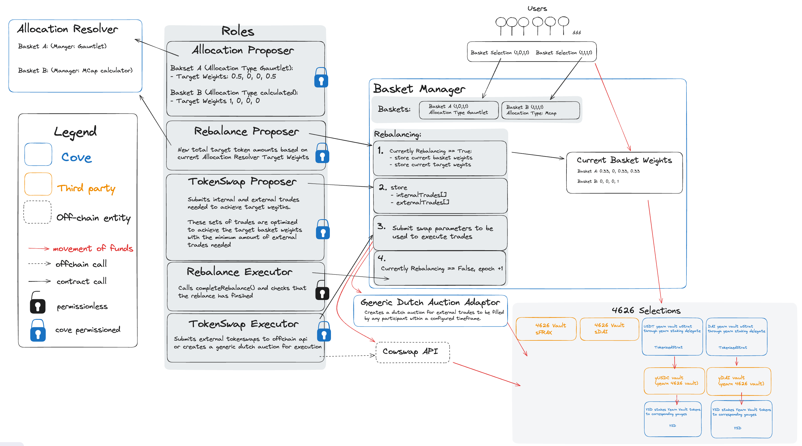

# cove-contracts-core


<div align="center">

[](https://codecov.io/gh/Storm-Labs-Inc/cove-contracts-core)
[](https://github.com/Storm-Labs-Inc/cove-contracts-core/actions/workflows/ci.yml)
[](https://discord.gg/xdhvEFVsE9)
[](https://twitter.com/intent/user?screen_name=cove_fi)

</div>

This repository contains the core smart contracts for the Cove Protocol.

The testing suite includes unit, integration, fork, and invariant tests.

For more detailed information, visit the [documentation](https://docs.cove.finance/) or the
[technical RFC](https://docs.cove.finance/technical/cove-rfc).

> [!IMPORTANT]
> You acknowledge that there are potential uses of the [Licensed Work] that
> could be deemed illegal or noncompliant under U.S. law. You agree that you
> will not use the [Licensed Work] for any activities that are or may
> reasonably be expected to be deemed illegal or noncompliant under U.S. law.
> You also agree that you, and not [Storm Labs], are responsible for any
> illegal or noncompliant uses of the [Licensed Work] that you facilitate,
> enable, engage in, support, promote, or are otherwise involved with.

## Prerequisites

Ensure you have the following installed:

- [Node.js](https://nodejs.org/) (v20.15.0)
- [Python](https://www.python.org/) (v3.9.17)

## Installation

Setup [pyenv](https://github.com/pyenv/pyenv?tab=readme-ov-file#installation) and install the python dependencies:

```sh
pyenv install 3.9.17
pyenv virtualenv 3.9.17 cove-contracts-core
pyenv local cove-contracts-core
pip install -r requirements.txt
```

Install node and build dependencies:

```sh
# Install node dependencies
pnpm install
# Install submodules as soldeer dependencies
forge soldeer install
```

## Usage

Build the contracts:

```sh
pnpm build
```

Run the tests:

```sh
pnpm test
```

### Run slither static analysis

[Install slither](https://github.com/crytic/slither?tab=readme-ov-file#how-to-install) and run the tool:

```sh
pnpm slither
```

To run the [upgradeability checks](https://github.com/crytic/slither/wiki/Upgradeability-Checks) with
`slither-check-upgradeability`:

```sh
pnpm slither-upgradeability
```

### Run semgrep static analysis

[Install semgrep](https://github.com/semgrep/semgrep?tab=readme-ov-file#option-2-getting-started-from-the-cli) and run
the tool:

```sh
pnpm semgrep
```

## Deploying contracts to live network

### Local mainnet fork

```sh
# Run a fork network using anvil
anvil --rpc-url <fork_network_rpc_url>
```

Keep this terminal session going to keep the fork network alive.

Then in another terminal session:

```sh
# Deploy contracts to local fork network
pnpm localDeploy
```

- Deployments will be in `deployments/<chainId>-fork`.
- Make sure not to commit `broadcast/`.
- If trying to deploy a new contract, either use the default deployer functions or generate them with:
  `$ ./forge-deploy gen-deployer`.

## Contract Architecture



## Audits

Smart contract audits of the Cove Protocol are available [here](https://github.com/Storm-Labs-Inc/cove-audits).
