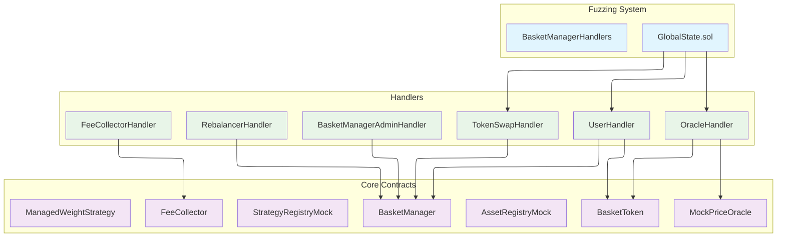
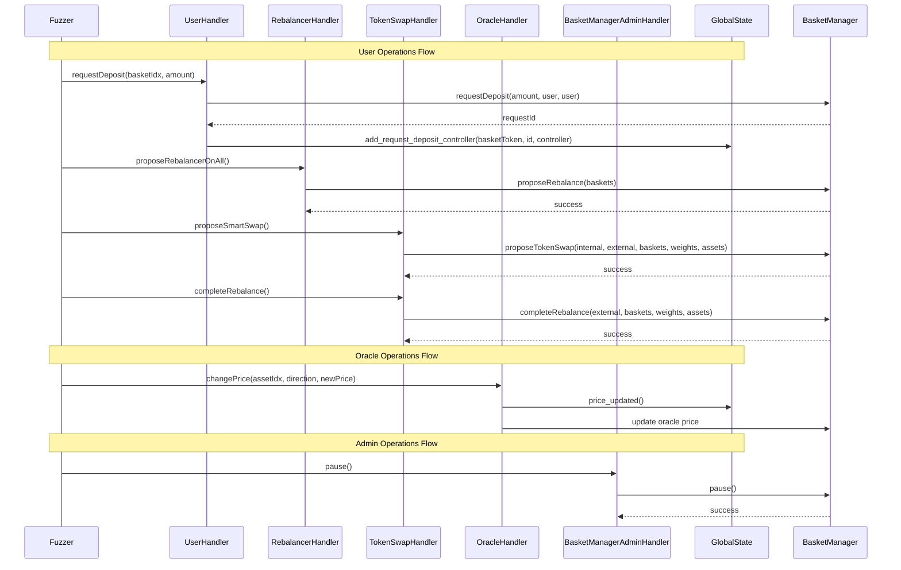

# BasketManager Fuzzing Harness - Handler System

## Table of Contents

- [BasketManager Fuzzing Harness - Handler System](#basketmanager-fuzzing-harness---handler-system)
  - [Table of Contents](#table-of-contents)
  - [Overview](#overview)
  - [Design](#design)
  - [Architecture](#architecture)
    - [Interactions](#interactions)
    - [Components](#components)
      - [Deployment System (`BasketManagerHandlers.deployement.t.sol`)](#deployment-system-basketmanagerhandlersdeployementtsol)
      - [Mocks (`/test/utils/mocks`)](#mocks-testutilsmocks)
      - [User Handlers (`/user/`)](#user-handlers-user)
      - [Other Handlers](#other-handlers)
      - [Global State Management (`GlobalState.sol`)](#global-state-management-globalstatesol)
      - [PoC Generation System (`/poc/`)](#poc-generation-system-poc)
  - [Design Choices](#design-choices)
    - [Handler Decoupling](#handler-decoupling)
    - [Local Deployment](#local-deployment)
    - [Mock-Based Architecture](#mock-based-architecture)
    - [Modular Architecture](#modular-architecture)
    - [User Architecture](#user-architecture)
    - [Benefits summary](#benefits-summary)
  - [Usage Guide](#usage-guide)
    - [Basic Setup](#basic-setup)
    - [Adding New Users](#adding-new-users)
  - [Handler Interaction Patterns](#handler-interaction-patterns)
    - [User Operations](#user-operations)
    - [Admin Operations](#admin-operations)
    - [Rebalance Operations](#rebalance-operations)
    - [Oracle Operations](#oracle-operations)
  - [Invariants](#invariants)
  - [Medusa integration](#medusa-integration)
  - [Summary](#summary)

## Overview

This document describes the redesigned fuzzing harness for the BasketManager protocol, which provides a more modular, maintainable, and powerful approach to invariant testing.

## Design

The new handler system was built with the following core principles:

1. **Separation of Concerns**: Each handler is responsible for a specific domain of operations
2. **Modularity**: Handlers can be easily added, removed, or modified without affecting others
3. **Isolation**: Actions are isolated to prevent unintended side effects
4. **Local Testing**: Standalone deployment without external dependencies

## Architecture



### Interactions



### Components

The system is organized

- Local deployement contract
- Mock contracts
- And specialized handlers, each responsible for specific operations

#### Deployment System (`BasketManagerHandlers.deployement.t.sol`)

Deploy all the relevant contracts and set the access controls.

#### Mocks (`/test/utils/mocks`)

Three mocks were added (AssetRegistryMock, StrategyRegistryMock, TokenSwapAdaptorMock) and
two mocks were improved (MockFeeCollector, MockPriceOracle).

#### User Handlers (`/user/`)

The user logic is split into multiple contracts:

- **UserHandler**: Complete user operations (request + execute)
- **ControllerOnlyUserHandler**: Execute deposits/redeems only
- **RequesterOnlyUserHandler**: Request deposits/redeems only
- **UserBaseHandler**: Base functionality for all user handlers

The inheritance tree of the user handlers allow to create users with partial responsabilities (ex: having a user only creating request for other users).

For example

```solidity
// Create a user, the controller and owner will be the user itself
UserHandler alice = new UserHandler(basketManager, globalState, address(0x0), address(0x0), false);

// Create a user that will call the controller only operation
ControllerOnlyUserHandler aliceController = new ControllerOnlyUserHandler(basketManager, globalState, address(alice), address(0x0), false);

// Use prank so that we don't have to add the logic to call setOperator
// In the handler. So that the function is not fuzzed
vm.prank(address(alice));
basketToken.setOperator(address(aliceController), true);

// Create a malicious user, which will call the function targeting alice
UserHandler eve = new UserHandler(basketManager, globalState, address(alice), address(alice), true); // The last boolean indicates that this is a malicious user
```

In the above setup:

- `aliceController` will call `deposit` on alice's behalf
- `eve` will call `deposit` on alice's behalf, but the call will fail

If `eve` could succesfully call `deposit` using Alice's address (e.g. if `_onlySelfOrOperator(controller);` is removed from `deposit`), then the fuzzer will automatically find the issue (see `UserBaseHandler._success`'s logic and `INV-014`).

#### Other Handlers

- **BasketManagerAdminHandler** (`/admin/`): Administrative operations (pause, set fees, etc.)
- **TokenSwapHandler** (`/tokenswap/`): Token swap operations and rebalance execution
- **RebalancerHandler** (`/rebalancer/`): Rebalancer proposals
- **OracleHandler** (`/oracle/`): Price oracle updates
- **FeeCollectorHandler** (`/feecollector/`): Fee collection operations

#### Global State Management (`GlobalState.sol`)

The global state acts as a central place of information.
For now it only track the price update, and the controllers associated to a deposit request. It can be extended for further needs.

#### PoC Generation System (`/poc/`)

Examples of Solidity PoCs generated from medusa's reproducer

## Design Choices

### Handler Decoupling

- **Problem**: Original system had a single monolithic actor handling all operations
- **Solution**: Split into specialized handlers with clear responsibilities
- **Benefits**:
  - Easier to understand and maintain
  - Better isolation of fuzzing actions
  - More realistic simulation of real-world usage
  - Easier to add new user types or operations

### Local Deployment

- **Problem**: Original system heavily relied on forge-deploy and mainnet forking
- **Solution**: Standalone local deployment with mocks
- **Benefits**:
  - No external dependencies
  - More predictable behavior
  - Easier debugging and reproduction

### Mock-Based Architecture

- **Problem**: Complex external dependencies (Euler, Chainlink, Pyth) make testing difficult
- **Solution**: Use mocks to abstract complex external systems
- **Benefits**:
  - Simplified price oracle (simple lookup table vs complex Euler integration)
  - Bypass complex external logic for focused testing
  - More control over test scenarios
  - Easier to manipulate prices and states

### Modular Architecture

- **Problem**: Tight coupling between test setup and fuzzing logic
- **Solution**: Clear separation between deployment, handlers, and test logic
- **Benefits**:
  - Reusable components
  - Easier to extend and modify
  - Better test organization
  - Clearer responsibility boundaries

### User Architecture

- **Problem**: Limited user interaction patterns in original system (i.e. array of actors)
- **Solution**: Configurable user-controller relationships
- **Benefits**:
  - Support for different user-operator scenarios
  - Default self-controller pattern (user controls themselves)
  - Extensible to complex operator relationships (user A has operator B)
  - More realistic testing of permission patterns

### Benefits summary

- **Improved Maintainability**
  - **Clear Structure**: Each handler has a single responsibility
  - **Easy Extension**: New handlers can be added without modifying existing code
- **Advanced Testing**
  - **Multiple Actors**: Multiple user handlers simulate real-world usage patterns
  - **Handler and mock customization**: Customization allow for dedicated scenarios
- **Better Performance**
  - **Local Testing**: No network dependencies or forking overhead
  - **Medusa compatibility**: Medusa's performance and features (ex: coverage report) can now be leveraged
- **Enhanced Debugging**
  - **Reproducible PoCs**: Easy conversion of fuzzer findings to testable scenarios _(if used with medusa)_

## Usage Guide

### Basic Setup

```solidity
// The system automatically sets up all handlers in setUp()
contract MyTest is BasketManagerHandlers {
    function setUp() public override {
        super.setUp();
        // Additional setup if needed
    }
}
```

### Adding New Users

```solidity
function _create_user_handler() internal override {
    super._create_user_handler();

    // Add a new user handler
    UserHandler bob = new UserHandler(basketManager, globalState, address(0x0), address(0x0), false);

    // Fund the user
    for (uint256 i = 0; i < assets.length; i++) {
        assets[i].mint(address(bob), 100_000 * 10 ** assets[i].decimals());
    }

    users.push(bob);
}
```

## Handler Interaction Patterns

### User Operations

```solidity
// Request a deposit
users[0].requestDeposit(basketIdx, amount);

// Execute a deposit
users[0].deposit(basketIdx, amount);

// Request a redeem
users[0].requestRedeem(basketIdx, amount);

// Execute a redeem
users[0].redeem(basketIdx, amount);
```

### Admin Operations

```solidity
// Pause the system
basketManagerAdminHandler.pause();

// Unpause the system
basketManagerAdminHandler.unpause();

```

### Rebalance Operations

```solidity
// Propose rebalance
rebalancer.proposeRebalancerOnAll();

// Complete rebalance
tokenSwap.completeRebalance();
```

### Oracle Operations

```solidity
// Update prices
oracleHandler.changePrice(assetIdx, direction, newPrice);
```

See [`BasketManagerHandler.unit.t.sol`](./BasketManagerHander.unit.t.sol) for an example
of unit test leveraging the handler.

## Invariants

The fuzzing harness tests the following invariants to ensure protocol correctness:

| ID      | Invariant                                                                                             | Components                                                                           | Testing strategy                            |
| ------- | ----------------------------------------------------------------------------------------------------- | ------------------------------------------------------------------------------------ | ------------------------------------------- |
| INV-001 | Verifies asset conservation: sum of basket balances equals actual token balance when not in rebalance | [`BasketManagerHandlers.medusa.t.sol`](BasketManagerHandlers.medusa.t.sol#L42-L82)   | Stateful fuzzing (invariant)                |
| INV-002 | Verifies oracle configurations remain valid and return non-zero values                                | [`BasketManagerHandlers.medusa.t.sol`](BasketManagerHandlers.medusa.t.sol#L88-L95)   | Stateful fuzzing (invariant) (**disabled**) |
| INV-003 | Verifies basket registration consistency: count, indices, and mapping integrity                       | [`BasketManagerHandlers.medusa.t.sol`](BasketManagerHandlers.medusa.t.sol#L100-L113) | Stateful fuzzing (invariant)                |
| INV-004 | Verifies basket registration consistency for known baskets and their basketIds                        | [`BasketManagerHandlers.medusa.t.sol`](BasketManagerHandlers.medusa.t.sol#L117-L158) | Stateful fuzzing (invariant)                |
| INV-005 | Verifies BasketManager configurations are within intended hardcoded bounds                            | [`BasketManagerHandlers.medusa.t.sol`](BasketManagerHandlers.medusa.t.sol#L164-L185) | Stateful fuzzing (invariant)                |
| INV-006 | Verifies variable links are correct between BasketToken and BasketManager                             | [`BasketManagerHandlers.medusa.t.sol`](BasketManagerHandlers.medusa.t.sol#L197-L210) | Stateful fuzzing (invariant)                |
| INV-007 | Verifies rebalance status validity: retry count, basket mask, trade hashes, and timestamps            | [`BasketManagerHandlers.medusa.t.sol`](BasketManagerHandlers.medusa.t.sol#L220-L275) | Stateful fuzzing (invariant)                |
| INV-008 | Verifies asset index consistency and base asset index validity for each basket                        | [`BasketManagerHandlers.medusa.t.sol`](BasketManagerHandlers.medusa.t.sol#L279-L300) | Stateful fuzzing (invariant)                |
| INV-009 | Verifies that completeRebalance reverts when step delay has not been met                              | [`BasketManagerHandlers.medusa.t.sol`](BasketManagerHandlers.medusa.t.sol#L308-L325) | Stateful fuzzing (invariant)                |
| INV-010 | Verifies ERC20 total supply consistency: totalSupply equals sum of all holder balances                | [`BasketManagerHandlers.medusa.t.sol`](BasketManagerHandlers.medusa.t.sol#L335-L360) | Stateful fuzzing (invariant)                |
| INV-011 | Verifies that max functions (maxDeposit, maxMint, maxRedeem, maxWithdraw) don't revert                | [`BasketManagerHandlers.medusa.t.sol`](BasketManagerHandlers.medusa.t.sol#L368-L385) | Stateful fuzzing (assertion)                |
| INV-012 | Verifies that totalAssets() approximates sum of oracle quotes within 1% tolerance                     | [`BasketManagerHandlers.medusa.t.sol`](BasketManagerHandlers.medusa.t.sol#L396-L450) | Stateful fuzzing (invariant) (**disabled**) |
| INV-013 | Verifies the deposit request asset consistency                 | [`BasketManagerHandlers.medusa.t.sol`](BasketManagerHandlers.medusa.t.sol#L450-L484) | Stateful fuzzing (invariant) |
| INV-014 | Verifies that successful deposit operations indicate non-malicious caller                             | [`user/ControllerOnlyUserHandler.sol`](user/ControllerOnlyUserHandler.sol#L15-L30)   | Stateful fuzzing (assertion)                |
| INV-015 | Verifies that successful mint operations indicate non-malicious caller                                | [`user/ControllerOnlyUserHandler.sol`](user/ControllerOnlyUserHandler.sol#L32-L47)   | Stateful fuzzing (assertion)                |
| INV-016 | Verifies that deposit with wrong amount (different from maxDeposit) should revert                     | [`user/ControllerOnlyUserHandler.sol`](user/ControllerOnlyUserHandler.sol#L58-L75)   | Stateful fuzzing (assertion)                |
| INV-017 | Verifies that successful claimFallbackAssets operations indicate non-malicious caller                 | [`user/ControllerOnlyUserHandler.sol`](user/ControllerOnlyUserHandler.sol#L77-L92)   | Stateful fuzzing (assertion)                |
| INV-018 | Verifies that successful redeem operations indicate non-malicious caller                              | [`user/ControllerOnlyUserHandler.sol`](user/ControllerOnlyUserHandler.sol#L94-L109)  | Stateful fuzzing (assertion)                |
| INV-019 | Verifies that successful withdraw operations indicate non-malicious caller                            | [`user/ControllerOnlyUserHandler.sol`](user/ControllerOnlyUserHandler.sol#L111-L126) | Stateful fuzzing (assertion)                |
| INV-020 | Verifies that redeem with wrong amount (different from maxRedeem) should revert                       | [`user/ControllerOnlyUserHandler.sol`](user/ControllerOnlyUserHandler.sol#L128-L145) | Stateful fuzzing (assertion)                |
| INV-021 | Verifies that successful claimFallbackShares operations indicate non-malicious caller                 | [`user/ControllerOnlyUserHandler.sol`](user/ControllerOnlyUserHandler.sol#L147-L162) | Stateful fuzzing (assertion)                |

**Invariant Coverage Summary:**

- **Total Invariants:** 19 (+2 disabled)
- **Main Test File:** `BasketManagerHandlers.medusa.t.sol` (13 invariants)
- **User Handler File:** `ControllerOnlyUserHandler.sol` (8 invariants)

Note:

- INV-002 was disabled given that the current mock for the oracle don't include path
- INV-012 was disabled given than the current approximation threshold fail

## Medusa integration

[medusa.json](../../../medusa.json) contains the configuration to run the project.

Note:

- `targetFunctionSignatures` contains all the functions that will be called by medusa. If new handlers functions are added, this needs to be updated
- The current configuration file does not work on `medusa@master`, but I will add the missing PRs to medusa's repo in the upcoming days and update this README.

## Summary

The new handler system represents a significant improvement in the BasketManager fuzzing infrastructure. By decoupling concerns, improving modularity, and enabling local testing, it provides a more robust, maintainable, and effective approach to invariant testing.

The system's design choices prioritize:

- **Clarity**: Clear separation of responsibilities
- **Maintainability**: Easy to understand and modify
- **Effectiveness**: Better fuzzing coverage and debugging capabilities
- **Scalability**: Easy to extend with new handlers and operations
- **Simplicity**: Abstracted complex external dependencies through mocks

This architecture serves as a solid foundation for ongoing security testing and can be easily adapted as the protocol evolves. The modular design allows for focused development of additional invariants while maintaining the flexibility to test complex user interaction patterns.
